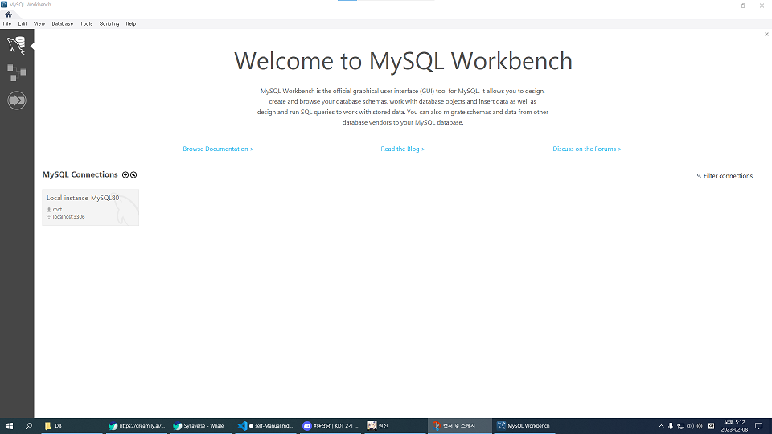
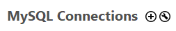
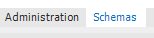
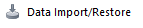
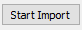
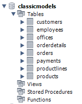
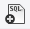
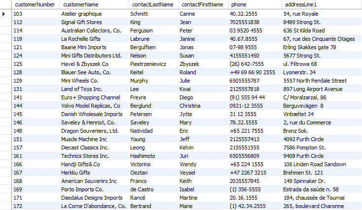

23.02.08 Data Base day1<br>

# MySQL Workbench 나만의 가이드 만들기
-오늘 좀 난해하다. 그동안 알고리즘 하면서 정답을 단시간에 뽑아내는 거에 익숙해져서 그런가보다<br>

## 0. 그럼 먼저 이게 뭔지부터 볼까
-내가 이것을 정의하는 과정이 필요한 거라시니 그냥 평소 인터넷 말투로 쓸까. 음슴체였다 아니었다 함.<br>
~~-아 br 오랜만에 써본다~~<br>

### MySQL Workbench? 모야그게.
-workbench는 오라클에서 정식으로 출시한 MySQL의 GUI이다.<br>
-...<br>
-ㅋ..<br>
-~~이걸 설명하라는 거겠냐~~<br>

### 제대로 설명해라
~~-자문자답이지만 갈구지마라~~<br>
-그럼 위에서부터 천천히 가자.<br>
-오늘부터 DB, ~~동부화재 아니~~ 데이터 베이스에 대한 교육에 들어간다.<br>
-그러니까 어쨌든 저거는 일단 DB에 관련된 얘기다.<br>
-너무 올라갔나?<br>
-근데 어쩌겠나. 내 손으로 정리해 놓으면 나중에 좋을거다. 아마도.<br>

## 1. Date Base
-데이터 뭉치.<br>
-아니라고?<br>
-사실 오늘 강의를 듣기 전에는 그냥 저거라고 생각했음<br>

### 다시. Data Base
-이번엔 데이터가 뭔지부터 설명할 건가? 알지? 생략하자.<br>
-아무튼 우리는 아주 많은 데이터에 둘러싸여 있고, 데이터는 이 순간에도 무수히 증가하고 있다.<br>
-단순히 데이터를 나열하고(ex:txt), 쪼끔 나아가서 스프레드 시트로 인덱스를 잡는 것 만으로는 데이터를 간수하기가 어려워지고 있다 이거다.<br>
-그래서 보다 체계적이고 관리하기 좋게 데이터를 쌓아놓을 필요가 생겼으니<br>
-그 방식을 DB라고 총칭한다.<br>

## 2. Relation DB
-별도의 것으로 보이는 DB를 키(기본 키, 외래 키)를 기준으로 삼거나 참고해서 관계성을 만드는 DB<br>
-열과 행으로 데이터를 정리하는데(이거를 Table이라고 하고) 여기까지는 스프레드 시트랑 똑같지만 이제 동시에 관리할 수 있는 스프레드 시트 묶음<br>
-어느 DB의 Table1의 a항목을 Table2와 Table3에서 참고한다고 할 때 Table1의 a를 수정하면 2, 3번 Table의 a가 동시에 바뀜<br>

### 용어
Table​<br>: 열과 행으로 만든 표<br>
Field​<br>: 열. 공통된 타입을 데이터를 넣는다 (ex:이름 필드에 미연, 민니, 소연, 우기, 슈화..)<br>
Record​<br>: 행. 구체적인 각각의 데이터의 모음 (ex:우기|1999년 9월 23일생|(여자)아이들|...)<br>
~~리스트의 튜플과는 다르다~~<br>
Database<br>: 관계 있는 table의 묶음<br>
Primary Key(PK)<br>: record의 고유키. 민번 같은 것<br>
Foreign Key(FK)<br>: 다른 table의 PK를 참고하는 키

### RDBMS
-Relation database management system<br>
-~~길어~~<br>
-글자 그대로 Relation DB를 관리하기 위한 시스템. 디비 관리 프로그램이란 얘기다.<br>
-그 중에 하나가 MySQL<br>

### Workbench
-MySQL을 CLI말고 GUI로 쓸 수 있게 해 주는 인터페이스.<br>

### 그러면 다시 한 번 MySQL Workbench
-Relation DB 관리 툴 중 하나인 MySQL을 GUI로 사용할 수 있도록 해 주는 프로그램.<br>
-다른 RDBMS도 쓸 수 있는지는 아직 모르겠다<br>

## 3. MySQL Workbench

### MySQL 연동

<br>
<br>
-Workbench를 켜면 이런 웰컴화면이 뜬다<br>
-스샷에는 내가 설치할 때 작성했던 기본 계정이 찍혀있어서 비번만 치면 로그인 할 수 있지만<br>
<br>
<br>
<br>
-여기에서 +를 눌러 새 계정을 작성하거나 육각렌치 모양을 눌러 관리, 수정할 수 있다<br>

### DB import

-일단 sample_db는 다운받았다고 치고 SCHEMAS 트리 아래에 있는 탭 메뉴에서<br><br>
<br>
-Administration 탭으로 전환한다<br>
-참고로 맥은 얘가 위에 있다<br>
<br>
<br>
-얘를 찾아서 sample_db를 import 해 보자<br>
<br>
<br>
-지금 라디오 버튼이 선택이 안 되어 있는데 아마도 다운로드 폴더에 있을 sql 파일을 불러와서<br>
<br>
<br>
-맨 오른쪽 구석의 얘를 찾아 누른다.<br>
-참고로 창 크기에 따라 잘 안 보일 수도 있더라<br>
-그리고 SCHEMAS 탭으로 돌아와서<br>
<br>
<br>
-이렇게 classicmodels DB가 생성되어 있으면 성공.<br>

### 쿼리 처리

>query 미국식 [ ˈkwɪri ] 영국식 [ ˈkwɪəri ]<br>
><br>
>「명사」 질의, 문의, 의문; 의심.<br>
>「동사」 묻다, 질의하다.<br>

<br>
-그리고 컴퓨터 언어에서는<br><br>

>데이터베이스 등에서 원하는 정보를 검색하기 위해 요청하는 것

-을 말한다.<br>
-SQL의 Q가 쿼리다<br>
<br>
<br>
-이걸로 에디터를 켜서<br>

```sql
SELECT * FROM customers;
```
-명령문을 쓴 다음<br>
<br>
<br>
-에디터 상단의 얘를 누르면<br>
-~~GUI는 이게 좋아 백글자로 CLI를 설명하는 것 보다 사진 한방~~<br>
<br>
<br>
-classicmodels DB의 customers table이 불러와진다<br>